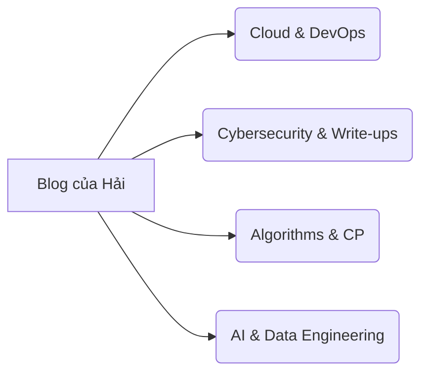

## 1. Giới thiệu chung

Chào mừng bạn đã ghé thăm góc kỹ thuật của mình! Blog này được xây dựng nhằm mục đích hệ thống hóa lại toàn bộ kiến thức, kinh nghiệm thực chiến và các bài Write-up của mình trên hành trình theo đuổi **Cloud Engineering, DevOps, Cybersecurity** và **Lập trình thuật toán**.

Nếu bạn muốn tìm hiểu nhanh về hồ sơ năng lực và các dự án mình đã thực hiện, bạn có thể bấm trực tiếp vào:
- 📌 **[About Me (Hồ sơ cá nhân & CV)](/about/)**
- 🚀 **[Projects (Các dự án tiêu biểu)](/projects/)**

---

## 2. Các chủ đề chính trên Blog (Thử nghiệm vẽ sơ đồ bằng Mermaid)

Khi lên web, đoạn chữ dưới đây sẽ tự động biến thành một sơ đồ nhánh:



---

## 3. Thử nghiệm hiển thị Code

Một đoạn code C++ mẫu với tính năng tô màu cú pháp và nút Copy tự động ở góc phải:

```cpp
#include <bits/stdc++.h>
using namespace std;

int main() {
    ios_base::sync_with_stdio(false);
    cin.tie(NULL);
    cout << "Hello from Nguyen Duc Hai's Technical Blog!\n";
    return 0;
}
```

Cảm ơn bạn đã ghé đọc!
